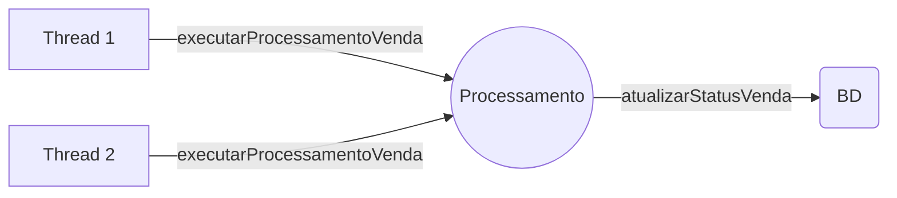
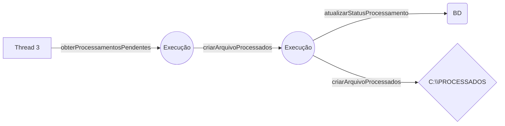

## LASA-Projeto
> **Desenvolvedor:** Eduardo Martins - [LinkedIn
](https://www.linkedin.com/in/eduardo-martins-849534110/)

<br>
<br>
Projeto para avaliação no processo seletivo da empresa TO Brasil. <br>
A ideia do projeto é processar determinadas vendas a partir de uma base de dados ou WebService, transformar alguns dados específicos e extraí-los em forma de um arquivo TXT posicional. <br>
Similar ao processo de ETL.
<br>
<br>
<br>

|                  
|Tecnologias Utilizadas                          |
|-------------------------------------------|-------------------------------|
|Linguagem de Programação:  |`Java`            |
|Framework MVC              |`Spring MVC`            |
|RESTful Web Services        |`Jersey`|
|Scheduler Framework        |`Quartz Job Scheduler`|
|Manuseio do Banco de Dados |`Spring JDBC`|
|Criação de Arquivos de Log           |`Log4J`|
|Ferramenta de Automação de Compilação      |`Apache Maven`|
|Framework Front-End      |`AngularJS`|
|Framework Front-End      |`BootStrap`|
|Container de Servlet/Servidor de Aplicação |`Apache TomCat`|
|Banco de Dados                             |`MySQL`|
|Desenvolvimento de componente de Interface |`BootStrap`|
|Ambiente de Desenvolvimento(IDE)           |`Eclipse`|


# Diagrama de Estados - Simplificado
> **Diagrama de Estados - Simplificado:** É uma representação do **estado** ou situação em que um objeto pode se encontrar no decorrer da execução de processos de um sistema.

Segue abaixo a disponibilização de um diagrama de estados simplificado para melhor entendimento da solução utilizada para o problema.


##### Primeira Etapa:



##### Segunda Etapa:




# Configurações Necessárias

Abaixo, um tutorial rápido de como inicializar a aplicação LASA-Projeto em sem ambiente de desenvolvimento.

##### Dependencias do Maven


```xml 
<myxml>
   <someElement />  
</myxml>
```mermaid


```


###### Tabela: tb_venda
| id_venda_item |   |   |   |   |
|:-------------:|:-:|---|---|---|
|       1       |   |   |   |   |
|       1       |   |   |   |   |
|       1       |   |   |   |   |

